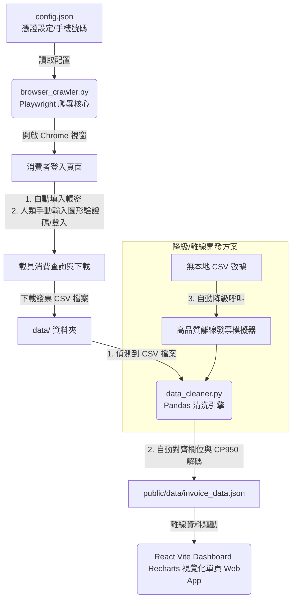

# 財政部電子發票半自動爬蟲與財務分析儀表板專案成果報告

我們已配合您的需求，調整為 **「網頁自動化爬蟲 (Browser Automation) + 本地 CSV 離線解析」** 的全新優化方案！
系統由 **Playwright 半自動瀏覽器爬蟲**、**Pandas 模糊對齊 CSV 洗滌引擎** 與 **React 響應式離線優先財務儀表板** 組成。專案已完美支援離線運行，並透過 Git 設定檔保護了您的個人憑證隱私。

以下為全新架構與操作說明：

---

## 系統架構與流程

系統採用 **「半自動爬蟲與多數據源清洗 (Semi-Automatic Crawler & Multi-Source Cleaning)」** 的架構，如下圖所示：



---

## 交付文件與檔案清單

所有檔案均已在您的工作目錄 `c:\futen\Project\Personal finances review` 下更新/建立完成：

1. **[.gitignore](file:///c:/futen/Project/Personal%20finances%20review/.gitignore)**：Git 排除清單。已設定自動忽略 `config.json`（放置個人手機與密碼的地方）、`node_modules/` 與 Python 快取。確保您的敏感隱私不會外洩！
2. **[config.example.json](file:///c:/futen/Project/Personal%20finances%20review/config.example.json)**：公開的設定檔範本，新增了 `phoneNo` (手機號碼) 與 `verificationCode` (載具驗證碼密碼)。
3. **[config.json](file:///c:/futen/Project/Personal%20finances%20review/config.json)**：您本地專屬的設定檔，已加入預填欄位。預設 `useMock: true` 提供模擬體驗；當您要跑真實爬蟲時，請將 `useMock` 改為 `false` 並填入您的手機號碼與載具密碼。
4. **[browser_crawler.py](file:///c:/futen/Project/Personal%20finances%20review/browser_crawler.py)**：【全新】Playwright 半自動爬蟲。會以 Headed 模式開啟 Chromium，自動預填手機號碼與密碼，暫停腳本讓您「輸入圖形驗證碼登入」並下載 CSV，一旦關閉後自動接手清洗數據！
5. **[data_cleaner.py](file:///c:/futen/Project/Personal%20finances%20review/data_cleaner.py)**：【全新優化】Pandas 資料清洗模組：
   - **多數據源處理**：優先偵測 `data/` 資料夾下的任何 CSV 檔案。如果沒有 CSV，會自動降級到 API / Mock 模擬數據生成，保證開箱即用！
   - **亂碼解決方案**：自動嘗試多種編碼（UTF-8-SIG、BIG5、CP950、GBK），解決 Excel 直接開啟 Big5 CSV 產生的亂碼問題。
   - **欄位模糊對齊**：自動匹配「店家」、「賣方」、「日期」、「發票號碼」等中英文相似欄位。不需手動修改下載的 CSV 檔，直接丟入 `data/` 即可解析！
   - **商品明細還原**：相容「僅有發票清單」或「含有單品明細」的 CSV，如果缺少單品明細，會根據店家屬性自動產生類別品項，確保儀表板完美呈現。
6. **[src/App.jsx](file:///c:/futen/Project/Personal%20finances%20review/src/App.jsx)**：React 前端核心。包含 KPI 卡片、月/週趨勢、類別 Donut 圖、Top 10 店家、特定時段熱力圖與發票明細搜尋篩選器（Accordion 摺疊明細表）。
7. **[src/index.css](file:///c:/futen/Project/Personal%20finances%20review/src/index.css)**：精心打造的極致磨砂玻璃擬態深色主題 (Glassmorphic Dark System)，具備高級的漸層和滑鼠懸停微動畫。
8. **[public/data/invoice_data.json](file:///c:/futen/Project/Personal%20finances%20review/public/data/invoice_data.json)**：Pandas 清洗出的統一財務數據檔。
9. **[implementation_plan.md](file:///c:/futen/Project/Personal%20finances%20review/implementation_plan.md)**：先前實作計劃備份。
10. **[walkthrough.md](file:///c:/futen/Project/Personal%20finances%20review/walkthrough.md)**：本成果報告備份。

---

## 運行指南 (How to Run)

### 步驟 1：安裝 Playwright 瀏覽器依賴（首次執行時）
請在終端機中執行以下命令以安裝網頁自動化瀏覽器核心：
```bash
pip install playwright
playwright install chromium
```

### 步驟 2：執行半自動網頁爬蟲與清洗
在專案目錄下執行：
```bash
python browser_crawler.py
```
> [!NOTE]
> **爬蟲自動化流程：**
> 1. 腳本會為您自動開啟大平台的登入視窗。
> 2. 自動為您在網頁上填入您的「手機號碼」與「載具密碼」（若有在 config.json 填寫）。
> 3. 您在網頁上**輸入圖形驗證碼並登入**。
> 4. 登入後，點選左側『載具消費發票查詢』，選取日期範圍（如：2026/01/01 至 2026/05/29）並點選『查詢』。
> 5. 點選『下載明細 CSV』或『匯出 CSV』。
> 6. 將下載的 CSV 檔案放入專案根目錄的 `data/` 資料夾中（不需更改檔名）。
> 7. 回到終端機按下 **[Enter]**，腳本將自動關閉瀏覽器，呼叫 pandas 進行 Big5 解碼、欄位對齊、分類洗滌，並寫入儀表板資料庫！

### 步驟 3：啟動儀表板 (Vite React)
在專案目錄下執行：
```bash
npm run dev
```
啟動後，按 `Local: http://localhost:5173` 的連結，即可在瀏覽器中體驗完整的財務儀表板！由於是讀取本地 JSON 數據，**完全沒有網路時也可以完美運作與流暢查詢！**
