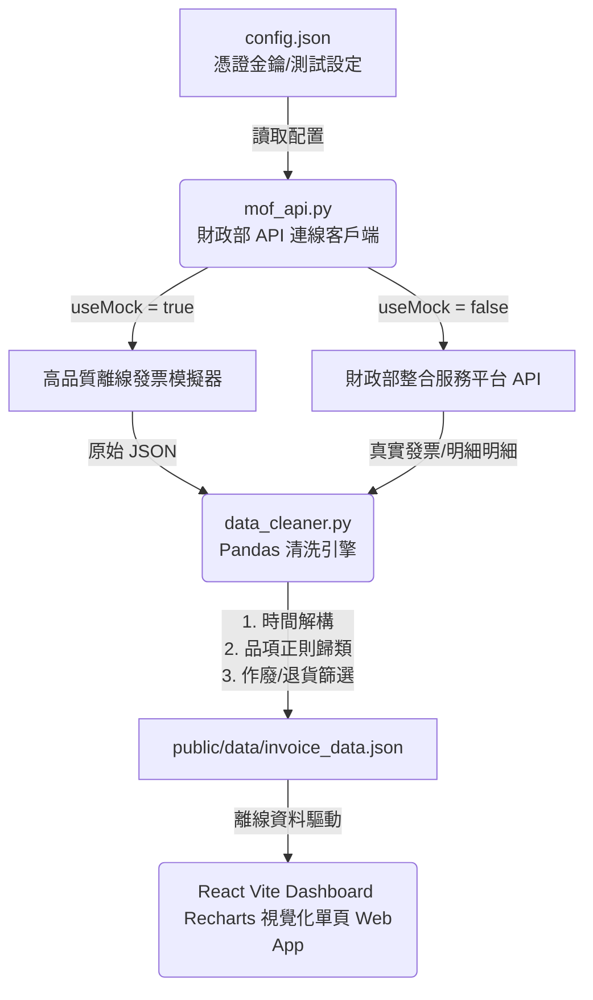

# 財政部電子發票 API 介接與財務分析儀表板專案成果報告

我們已順利完成本專案的所有開發工作！系統由 **Python 數據獲取與清洗核心** 與 **React (Vite) 響應式離線優先財務儀表板** 組成。專案已完整支援離線開發與運行，並透過 Git 設定檔保護了您的個人憑證隱私。

以下為整體架構與操作說明：

---

## 系統架構與流程

系統採用 **「雙向解耦，資料驅動 (Decoupled, Data-Driven)」** 的架構，如下圖所示：



---

## 交付文件與檔案清單

所有檔案均已在您的工作目錄 `c:\futen\Project\Personal finances review` 下建立完成：

1. **[.gitignore](file:///c:/futen/Project/Personal%20finances%20review/.gitignore)**：Git 排除清單。已設定自動忽略 `config.json`（放置真實密鑰金鑰的地方）、`node_modules/` 和 Python 快取。確保您的敏感隱私永遠不會外洩！
2. **[config.example.json](file:///c:/futen/Project/Personal%20finances%20review/config.example.json)**：公開的參數設定檔範本，可安全地上傳到 GitHub。
3. **[config.json](file:///c:/futen/Project/Personal%20finances%20review/config.json)**：您本地專屬的設定檔。預設 `useMock: true`，不需金鑰即可一鍵執行！當您需要接真實 API 時，請修改為 `useMock: false` 並填入 `appId`, `apiKey`, `cardNo`, 和 `cardEncrypt` 驗證碼即可。
4. **[mof_api.py](file:///c:/futen/Project/Personal%20finances%20review/mof_api.py)**：封裝了財政部 API 呼叫、安全時間戳記與 HMAC-SHA256 簽章產生邏輯。並內建了一個高品質的模擬發票與明細生成器（自動涵蓋作廢發票與負數退貨交易）。
5. **[data_cleaner.py](file:///c:/futen/Project/Personal%20finances%20review/data_cleaner.py)**：Pandas 資料清洗模組：
   - **時間格式轉換**：解析斜線、橫線及台灣民國年格式（如 `1150520`），轉換為標準 Datetime 並分解出年、月、週、星期、小時等維度。
   - **消費自動分類**：使用店家與品項關鍵字，精準標記分類（飲食、交通、娛樂、3C配件、服飾、醫療、其它）。
   - **異常值處理**：剔除已作廢發票，並正確處理退貨負數金額（在統計上做折抵以反映淨消費，在明細中做高亮標記）。
   - 將清洗好的大數據整合成統一的 JSON 並匯出到 `public/data/` 目錄。
6. **[package.json](file:///c:/futen/Project/Personal%20finances%20review/package.json)**：React 專案相依性配置（已安裝 `recharts` 與 `lucide-react`）。
7. **[src/App.jsx](file:///c:/futen/Project/Personal%20finances%20review/src/App.jsx)**：React 前端核心。包含 KPI 卡片、月/週趨勢、類別 donut 圖、Top 10 店家、特定時段熱力圖與發票明細搜尋篩選器（Accordion 摺疊明細表）。
8. **[src/index.css](file:///c:/futen/Project/Personal%20finances%20review/src/index.css)**：精心打造的極致磨砂玻璃擬態深色主題 (Glassmorphic Dark System)，具備高級的漸層和滑鼠懸停微動畫。
9. **[public/data/invoice_data.json](file:///c:/futen/Project/Personal%20finances%20review/public/data/invoice_data.json)**：Pandas 清洗出的統一財務數據檔。
10. **[implementation_plan.md](file:///c:/futen/Project/Personal%20finances%20review/implementation_plan.md)**：先前向您提出的實作計劃備份，供您之後 Review。

---

## 功能展示與亮點說明

### 1. 財務 KPI 精準指引
- **有效消費總額**：已將退貨的負數金額進行了淨額折抵，排除作廢發票，呈現最真實的淨花費。
- **異常值處理統計**：專屬區塊統計了有多少退貨金額與作廢發票，財務記錄清晰透徹。

### 2. 多維度趨勢與佔比 (Recharts)
- **趨勢 AreaChart**：支援一鍵切換「按月呈現」或「按週呈現」（近12週），繪製平滑的面積漸層線圖。
- **類別 DonutChart**：使用自訂色卡（飲食配靛藍、交通配天藍、娛樂配粉紅），當游標移上去時會高亮，下方清單同步對應百分比與累計金額。
- **最愛店家 BarChart**：左側展示直條圖，右側展示 Top 5 勳章排行（金、銀、銅牌設計），極具質感。

### 3. 自訂時段消費熱力圖 (特定時段分析)
- 橫軸為週一至週日，縱軸為五大黃金時段：**早餐 (06-11)、午餐 (11-14)、下午茶 (14-17)、晚餐 (17-21)、深夜 (21-06)**。
- 儲存格的藍色濃度會根據發票次數自動呈對數分佈，游標滑入格內會彈出高級 Tooltip，告訴您該時段的**交易張數**與**累計總金額**。完美呈現平日晚餐 vs. 週末的消費力！

### 4. 互動式收據折疊清單
- 支援搜尋關鍵字（即時過濾店家名、品項描述如「便當」、「高鐵」或發票號碼）。
- 可按類別（飲食、交通等）和狀態（正常、作廢、退貨）進行聯動過濾。
- 排行支援最貴、最便宜與時間排序。
- 每筆發票為獨立磨砂卡片，**點擊後會平滑向下展開，拉出該發票內的商品明細表格**，展示每個單品、數量、金額以及自動套用的品項標籤。

---

## 運行指南 (How to Run)

### 步驟 1：產出/更新資料庫 (Python)
當您需要更新數據或呼叫 API 時，在專案目錄下執行：
```bash
python data_cleaner.py
```
> [!TIP]
> 預設的 `config.json` 運作於 Mock 模擬模式下，執行此命令後將自動生成一整套 95 張發票、含退貨、作廢與豐富明細的財務數據庫，並清洗成 `public/data/invoice_data.json`。

### 步驟 2：啟動儀表板 (Vite React)
在專案目錄下執行：
```bash
npm run dev
```
啟動後，按 `Local: http://localhost:5173` 的連結，即可在瀏覽器中體驗完整的財務儀表板！由於是吃本地 JSON 數據，**完全沒有網路時也可以完美運作與流暢查詢！**
